# kastrup



**The fast unified messaging hub. Written in Rust.**

   

Unified terminal messaging client. All your email, chat, and feeds in one TUI. Built on [Crust](https://github.com/isene/crust). Feature clone of [Heathrow](https://github.com/isene/Heathrow) rewritten in Rust for speed and single-binary distribution.

## Features

- **Multi-source messaging**: Maildir email, RSS/Atom feeds, WeeChat/IRC, Messenger, Instagram
- **4-pane TUI**: source/message list, message content, info bar, and status bar
- **Threading**: flat, threaded, and folder-grouped message views
- **Background sync**: automatic polling with configurable intervals per source
- **Compose/Reply/Forward**: full email composition with editor integration
- **Inline images**: Kitty protocol image display (V key)
- **Folder browser**: hierarchical Maildir folder navigation (B key)
- **Search**: substring and notmuch full-text search
- **AI assistant**: draft, summarize, translate, ask (I key)
- **Address book**: contact storage and lookup (@ key)
- **Labels and tagging**: multi-select tagging, label management
- **Customizable themes**: full 256-color theme editor with presets
- **Per-view settings**: independent sort, thread mode, and section order per view
- **Shared database**: uses the same SQLite DB as Heathrow (~/.heathrow/heathrow.db)

## Install

Download the prebuilt binary from [Releases](https://github.com/isene/kastrup/releases), or build from source:

```bash
cargo build --release
cp target/release/kastrup ~/.local/bin/
```

## Key Bindings

| Key | Action |
|-----|--------|
| j/k, Up/Down | Navigate messages |
| Enter | Open message / expand section |
| A | All messages view |
| N | New/unread messages |
| S | Source management |
| 0-9 | Custom views |
| Space | Toggle read/unread |
| * | Toggle star |
| t | Tag/untag message |
| T | Tag all |
| d | Mark for deletion |
| $ | Purge deleted |
| r | Reply |
| f | Forward |
| c | Compose new |
| / | Search |
| G | Cycle view mode (flat/threaded/folder) |
| V | View inline images |
| v | View/save attachments |
| x | Open in browser |
| X | Open in Scroll |
| B | Folder browser |
| l | Manage labels |
| I | AI assistant |
| @ | Address book |
| P | Preferences |
| w | Adjust left pane width |
| Ctrl+B | Toggle borders |
| Ctrl+L | Refresh display |
| ? | Help |
| q | Quit |

## Configuration

Config file: `~/.heathrow/config.yml`

On first run, Kastrup creates the database and guides you through initial setup (default email, editor, SMTP command).

## Dependencies

Runtime: SQLite (bundled). Optional: `notmuch` (search), `montage` (multi-image compositing), `curl` (RSS feeds).

## Part of the Rust Terminal Suite

| Tool | Clones | Description |
|------|--------|-------------|
| [rush](https://github.com/isene/rush) | [rsh](https://github.com/isene/rsh) | Shell |
| [crust](https://github.com/isene/crust) | [rcurses](https://github.com/isene/rcurses) | TUI library |
| [kastrup](https://github.com/isene/kastrup) | [Heathrow](https://github.com/isene/heathrow) | Messaging hub |
| [pointer](https://github.com/isene/pointer) | [RTFM](https://github.com/isene/RTFM) | File manager |
| [scroll](https://github.com/isene/scroll) | [brrowser](https://github.com/isene/brrowser) | Web browser |
| [crush](https://github.com/isene/crush) | - | Rush config helper |

## License

[Unlicense](https://unlicense.org/) - public domain.

## Credits

Created by Geir Isene (https://isene.org) with extensive pair-programming with Claude Code.
