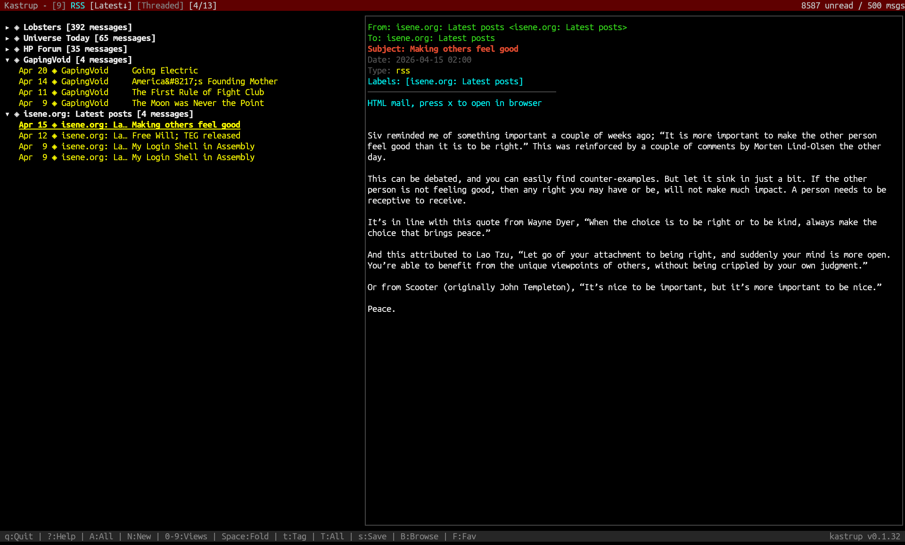

# kastrup



**The fast unified messaging hub. Written in Rust.**

   

Unified terminal messaging client. All your email, chat, and feeds in one TUI. Built on [Crust](https://github.com/isene/crust). Feature clone of [Heathrow](https://github.com/isene/Heathrow) rewritten in Rust for speed and single-binary distribution.

## Screenshot



*Unified messaging: threaded RSS feeds (shown), mail, chat, and Workspace in one inbox.*

## Features

- **Multi-source messaging**: Maildir email, RSS/Atom feeds, WeeChat/IRC, Messenger, Instagram
- **4-pane TUI**: source/message list, message content, info bar, and status bar
- **Threading**: flat, threaded, and folder-grouped message views
- **Background sync**: automatic polling with configurable intervals per source
- **Compose/Reply/Forward**: full email composition with editor integration
- **Send later**: `S` in the send review parks the message until its time (`08:00`, `tomorrow 09:00`, `+2h`, `2026-07-28 08:00`). Works for every channel, not just email; scheduled messages sit in the `+` picker where they can be cancelled or edited
- **Inline images**: Kitty protocol image display (V key)
- **Folder browser**: hierarchical Maildir folder navigation (B key)
- **Search**: substring and notmuch full-text search
- **Claude integration**: `I` = one-shot `claude -p` ask (response in right pane), `Ctrl+A` = full Claude session; `c` = AI assistant menu (draft / summarize / translate / ask + plugins)
- **AI triage** (z key): Claude reads the current message, optionally takes a free-text hint, and emits a JSON action plan (calendar events to [Tock](https://github.com/isene/tock) / todos to a [hyperlist](https://github.com/isene/hyperlist) at `~/.tasks/todo.hl`). Multi-pick preview before commit; rolling history via `:triage`
- **Address book**: contact storage and lookup (@ key)
- **Labels and tagging**: multi-select tagging, label management
- **Customizable themes**: full 256-color theme editor with presets
- **Per-view settings**: independent sort, thread mode, and section order per view
- **SQLite database**: messages and metadata at `~/.kastrup/kastrup.db`
- **Attachments** decoded by [fe2o3-mail](https://github.com/isene/mail), the same walk the phone uses
- **Read state shared with the phone**: mail marked read here shows read in the [nomad mail app](https://github.com/isene/nomad/tree/master/apps/mail), and an explicit *Mark READ* there reaches back. See [Read state](#read-state-shared-with-the-phone)

## Install

Download the prebuilt binary from [Releases](https://github.com/isene/kastrup/releases), or build from source:

```bash
cargo build --release
cp target/release/kastrup ~/.local/bin/
```

## Opening one message

```bash
kastrup 7957849
kastrup kastrup:7957849
```

Both forms work, because `kastrup:7957849` is how an id gets copied out
of a note or a chat and a bare number is what is left after trimming it.
The message opens on its own, as a one-line list with the body beside
it; `Esc` clears that back to the view you were in. An archived message
opens too — asking for a message by number is asking for that message.

Inside kastrup, `#` does the same thing and takes the same two forms —
the other end of `y`, which copies the id of the message under the
cursor.

## Key Bindings

### Navigation
| Key | Action |
|-----|--------|
| j/k, Down/Up | Move cursor |
| h, Left | Collapse current thread (threaded view) |
| Space | Toggle thread collapse |
| Home / End | First / last message |
| PgDn / PgUp | Page down / up |
| Enter | Open message (or expand section in threaded view) |
| n / p | Next / previous unread |
| J | Jump to date |
| G | Cycle view mode (flat / threaded / folder) |

### Views
| Key | Action |
|-----|--------|
| A | All messages |
| N | New (unread) |
| Ctrl-S | Sources management |
| 0-9 | Custom views |
| F1-F12 | Extended custom views |
| F | Favorites browser |
| L | Load more messages |
| Ctrl-R | Refresh current view |
| Ctrl-F | Edit filter |
| K | Kill (close) view |

### Message Operations
| Key | Action |
|-----|--------|
| R | Toggle read / unread |
| M | Mark all as read |
| `*` / `-` | Toggle star |
| t / T | Tag message / tag all |
| Ctrl-T | Tag by regex |
| d | Mark for deletion |
| `<` | Purge deleted |
| u / U | Mark unseen |
| Shift-Space | Mark browsed as read |

### Compose & Reply
| Key | Action |
|-----|--------|
| r | Reply |
| e | Reply in editor |
| g | Reply-all |
| f | Forward (then `i` inline / `a` attach) |
| + | Compose new (lists postponed + scheduled drafts; `q` backs out) |
| E | Edit draft |
| S | In the send review: schedule instead of sending now |

### Attachments & External
| Key | Action |
|-----|--------|
| v | View / save attachments (`p`/`P` open / save office docs as PDF) |
| V | Toggle inline image |
| D | Download images to disk |
| x | Open in external app |
| X | Open HTML in browser |

### Search & AI
| Key | Action |
|-----|--------|
| / | Search messages (notmuch + DB substring fallback) |
| `#` | Go to a message by id — `kastrup:7957849` or `7957849` |
| **S** | **`:search`** — natural-language query → claude translates to a `Filters` JSON spec → applied to the message list |
| @ | Address book |
| l | Label message |
| s | File / save message |
| `+` | Add to favorites |
| **I** | **`:claude PROMPT`** — one-shot: pipe message + custom prompt to `claude -p`, response shown in the right pane |
| **Ctrl+A** | **`:chat`** — full session: suspend kastrup, open interactive `claude` with the current message snapshot as context |
| c | AI assistant menu (draft / summarize / translate / ask + plugins) |
| C | Full Claude session (alias of Ctrl+A) |
| **`:`** | **Colon prompt** — type any verb explicitly: `:claude PROMPT`, `:search QUERY`, `:chat`, `:triage`, `:q`/`:quit` |
| Esc | Clear sticky search, return to current view |
| **z** | **AI triage** — Claude reads the current message (+ optional hint) and proposes calendar events / hyperlist todos; multi-pick preview before committing to `~/.tock/incoming/` and `~/.tasks/todo.hl` |
| Z | Open in Tock (regex date capture → calendar event) |
| **`:triage`** | Show the most recent 20 triage decisions from `~/.kastrup/triage.log` |

### UI
| Key | Action |
|-----|--------|
| o | Cycle sort order |
| i | Invert sort |
| w / W | Cycle pane width forward / back |
| H | Set top-bar (view) colour |
| B | Folder browser |
| Ctrl-B | Cycle border style |
| P | Preferences |
| y / Y | Copy message ID / copy right pane content |
| Ctrl-L | Force redraw |
| ? | Help (press again for extended help) |
| q | Quit |

## Configuration

Config file: `~/.kastrup/kastruprc`

On first run, Kastrup creates the database and guides you through initial setup (default email, editor).

### Read state shared with the phone

Set a folder Syncthing carries to the phone and mail read here shows read
there:

```yaml
ui:
  read_sync_dir: ~/.kastrup/sync # empty (the default) disables it entirely
  read_sync_days: 60             # must cover the phone's own window
```

Each device writes one `mail-read-<device>.json` and reads them all, keyed
by RFC822 `Message-ID`, so Syncthing never has two writers to leave a
`.sync-conflict-` copy of. Newest timestamp wins, and the merge is
[fe2o3-mail](https://github.com/isene/mail), shared with the phone so
neither end can invent its own answer.

The rule is asymmetric, and it falls out of what each side *writes*:

| Event | Effect |
|---|---|
| Read here | Read on the phone |
| Deleted here | Read on the phone |
| Anything on the phone | Stays on the phone |

Deleting travels because deleting is the strongest "done with this" there
is, and the phone reads the IMAP inbox directly — it never sees the
delete, so without this the message sits there as new for ever.

The arrow points one way. A phone writes nothing into the folder: it
reads what this laptop publishes and keeps its own marks in its own
prefs, so clearing a phone's list can never cost you mail here. kastrup
still merges every `mail-read-*.json` it finds, so a second authoritative
machine would work; it is the phones that stay quiet.

Idle cost is one atomic load plus a couple of `stat()`s every 5 s. The
database is queried only when a mark has actually moved on one side.

### External fetch scripts (messenger / instagram)

Both `messenger` and `instagram` source types shell out to a Python script that drives a Marionette-controlled Firefox. The default location is `~/.kastrup/plugins/<name>.py`. Override per-source with:

```yaml
fetch_script: ~/path/to/messenger_fetch.py
```

`~/` and `$HOME` are expanded.

### Views

Views are user-defined filter recipes stored in the `views` table. Each row's `filters` is a JSON blob with a `rules` array of `{field, op, value}` triples:

```json
{"rules": [{"field":"folder","op":"like","value":"python.slack.|irc.libera."}]}
```

To express OR across heterogeneous criteria — e.g. one view for "everything related to project Foo, across email AND Slack AND IRC" — use `branches` instead of (or together with) `rules`. Each branch is an independent rule set; results are unioned:

```json
{
  "name": "Foo",
  "branches": [
    {"rules": [{"field":"folder","op":"=","value":"Customers.Foo"}]},
    {"rules": [{"field":"folder","op":"like","value":"python.slack.workspace.#foo"}]},
    {"rules": [{"field":"sender","op":"like","value":"foo"}]}
  ],
  "top_bg": "24"
}
```

There's nothing source-specific about which view-key gets a "chat" badge or layout — any view (numbered or F-key) can mix mail folders, chat channels, and sender / content patterns however the user wants.

Supported rule fields: `read`, `starred`, `folder`, `source_id`, `source_type`, `sender`. Supported `op` values: `=` (exact) and `like` (SQL `LIKE %value%`, pipe-separated value gives OR-of-LIKE within the field).

## AI triage (`z` key)

Mail and chat make passable todo lists, but the bookkeeping is manual: read the message, decide if it's an event or a task, mentally route it. The `z` key delegates that triage to Claude.

Press `z` on any message:

1. **Optional hint** — kastrup prompts for free-text. Skip with Enter, or steer the result, e.g. `add as a reminder a week before the deadline mentioned in the linked PDF`.
2. **Triage call** — shells out to `~/.kastrup/triage.sh` (a small bash wrapper around `claude --print`). The system prompt at `~/.kastrup/triage-prompt.txt` constrains Claude to return a strict JSON array of action objects, with the current message subject / sender / folder / body and your tock calendar names + existing hyperlist categories as context.
3. **Multi-pick preview** — actions render in the right pane with `[x]` / `[ ]` markers. Space to toggle, j/k to move, Enter to commit selected, Esc to cancel.
4. **Commits** — calendar actions drop an ICS into `~/.tock/incoming/` (picked up by [Tock](https://github.com/isene/tock)); todo actions append to `~/.tasks/todo.hl` under the right category (creates the section if missing), atomically so an open scribe buffer reloads cleanly.
5. **History** — every triage decision logs to `~/.kastrup/triage.log` (rolling 20 entries). `:triage` displays the log in the right pane.

Both the prompt and the wrapper live as user-editable files in `~/.kastrup/` — tune the prompt without rebuilding kastrup. The shipped defaults install on first `z` use if missing.

Defaults the wrapper expects:

| File | Purpose |
|------|---------|
| `~/.kastrup/triage-prompt.txt` | System prompt sent to Claude |
| `~/.kastrup/triage.sh` | Shell wrapper around `claude --print` |
| `~/.tasks/todo.hl` | Destination [hyperlist](https://github.com/isene/hyperlist); edit in [scribe](https://github.com/isene/scribe) (which reloads on external append from v0.1.43) |
| `~/.tock/incoming/` | Drop folder for ICS events (existing Tock convention) |
| `~/.kastrup/triage.log` | Rolling history of triage decisions |

Action shapes Claude can return:

```json
[
  { "kind": "calendar",
    "title":        "Project kickoff",
    "when":         "2026-06-03T14:00:00+02:00",
    "duration_min": 60,
    "calendar":     "Work" },

  { "kind": "todo",
    "category":     "Personal",
    "text":         "Renew passport before travel" },

  { "kind": "clarify",
    "question":     "Body mentions both 'next week' and a fixed date — one event or two items?" }
]
```

A pure FYI message (newsletter, ack, etc.) returns `[]` — no actions, nothing to commit.

## Architecture

A detailed walk-through of the receive flows, send flows, auth matrix, threads and shared state, and the dedup scheme lives in [`docs/architecture.html`](docs/architecture.html). Open it locally for the rendered diagrams.

## Dependencies

Runtime: SQLite (bundled). Optional: `notmuch` (search), `montage` (multi-image compositing), `curl` (RSS feeds).

## Part of the Rust Terminal Suite

See the [Fe₂O₃ suite overview](https://github.com/isene/fe2o3) and the [landing page](https://isene.org/fe2o3/) for the full list of projects.

| Tool | Clones | Description |
|------|--------|-------------|
| [rush](https://github.com/isene/rush) | [rsh](https://github.com/isene/rsh) | Shell |
| [crust](https://github.com/isene/crust) | [rcurses](https://github.com/isene/rcurses) | TUI library |
| [kastrup](https://github.com/isene/kastrup) | [Heathrow](https://github.com/isene/heathrow) | Messaging hub |
| [pointer](https://github.com/isene/pointer) | [RTFM](https://github.com/isene/RTFM) | File manager |
| [scroll](https://github.com/isene/scroll) | [brrowser](https://github.com/isene/brrowser) | Web browser |
| [crush](https://github.com/isene/crush) | - | Rush config helper |

## License

[Unlicense](https://unlicense.org/) - public domain.

## Credits

Created by Geir Isene (https://isene.org) with extensive pair-programming with Claude Code.
